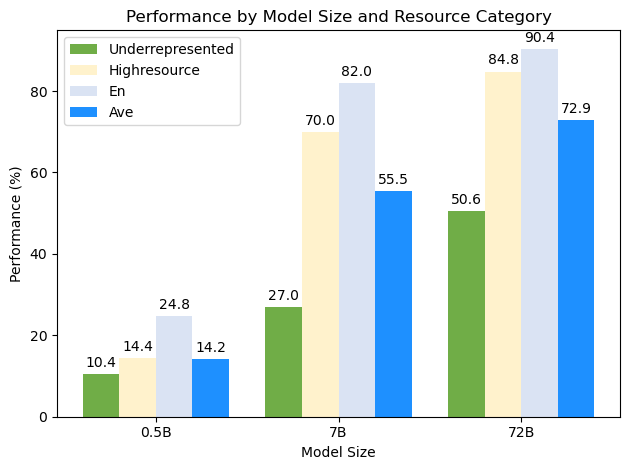
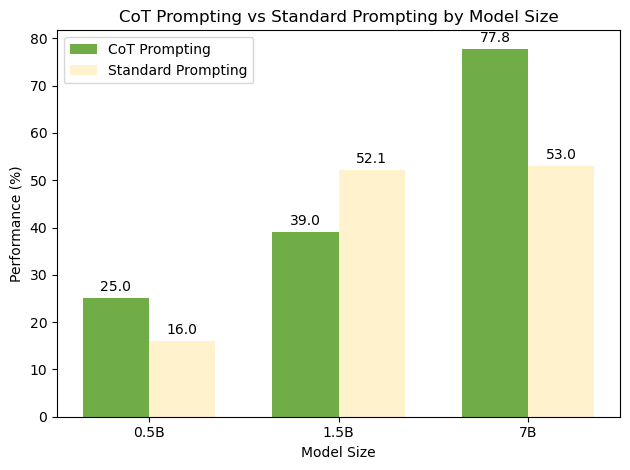

# The Second Part of the Aritificial Inteligence Major Production Internship  
  **@Date:** 2024-07-01~2024-07-20  
  **@Laboratory:** [NEU NLP](https://www.nlplab.com)  
  **@Author:** [Shan Xie](mailto:shanxie3003@gmail.com)  
***
## The First Stage of NLP Production Internship  
### 1. Introduction to NLP & Linux -- JunHao Ruan
 In this step, we covered basic Linux instructions, including file and directory management, network setup, and system services.  
 We also learned how to install the conda environment.  

   

 Above is my practice of installing the conda environment on Aliyun's server named DSW.  
### 2. Introduce to Pytoch -- XiangNan Ma
  In this step, we learned the basic knowledge of Pytoch and how to use it. We also learned how to build a simple FeedForword model for Handwritten Digit Recognition.  
```python
class NeuralNet(nn.Module):
    def __init__(self, input_size, hidden_size, num_classes):
        super(NeuralNet, self).__init__()
        self.fc1 = nn.Linear(input_size, hidden_size) 
        self.relu = nn.ReLU()
        self.fc2 = nn.Linear(hidden_size, num_classes)  
    
    def forward(self, x):
        out = self.fc1(x)
        out = self.relu(out)
        out = self.fc2(out)
        return out
        
model = NeuralNet(input_size, hidden_size, num_classes).to(device)

# Loss and optimizer
criterion = nn.CrossEntropyLoss()
optimizer = torch.optim.Adam(model.parameters(), lr=learning_rate)

total_step = len(train_loader)
for epoch in range(num_epochs):
    for i, (images, labels) in enumerate(tqdm(train_loader, desc=f"Epoch {epoch+1}/{num_epochs}", leave=False)):  
        # Reshape images to (batch_size, input_size)
        images = images.reshape(-1, 28*28).to(device)
        labels = labels.to(device)
        
        # Forward pass
        outputs = model(images)
        loss = criterion(outputs, labels)
        
        # Backward and optimize
        optimizer.zero_grad()
        loss.backward()
        optimizer.step()
```
  [FFN.py](/Record/FFN.py) 

### 3. Introduce to FNNLM & RNNLM -- YongYu Mu
 In this step, YongYu Mu introduced the fullyconnected neural network language model (FNNLM) and recurrent neural network language model (RNNLM). He also gave us some tips about how to train the model.  

 We achieve a FNNLM by ourselves using the Pytorch, and train it on the subset of  Penn Treebank dataset.  
```python
def make_batch(train_path, word2number_dict, batch_size, n_step):
    
    all_input_batch = []
    all_target_batch = []

    with open(train_path, 'r', encoding='utf-8') as fr:
        text = fr.readlines()
    text = [line.strip() for line in text]
 
    input_batch = []
    target_batch = []

    for sen in text:
     
        wordlist = sen.split()
  
        if(len(wordlist)<n_step):continue
  
        for i,word in enumerate(wordlist):
            if(i+n_step>=len(wordlist)):break
            input= []
            for j in range(n_step):
                input.append(word2number_dict[wordlist[i+j]])
            target =word2number_dict[wordlist[i+n_step]]
   
            input_batch.append(input)
            target_batch.append(target)
            
    for i in range(len(input_batch)):
        if i+batch_size>len(input_batch):
            break
        all_input_batch.append(input_batch[i:i+batch_size])
        all_target_batch.append(target_batch[i:i+batch_size])
  
    return all_input_batch, all_target_batch

```
 [FFNNLM.ipynb](/Record/NNLM-code/FFNNLM.ipynb)  

 

```python
class RNNLM(nn.Module):
    def __init__(self, vocab_size, embed_dim, hidden_dim):
        super(RNNLM, self).__init__()
        self.embed_dim = embed_dim
        self.embed = nn.Embedding(vocab_size, embed_dim)
        self.rnn = nn.RNN(embed_dim, hidden_dim)
        self.fc1 = nn.Linear(hidden_dim, vocab_size)
        
    def forward(self, X,hidden):
        X = self.embed(X) # X: [batch_size, n_step , embed_dim]
        X = X.transpose(0,1) # X: [n_step, batch_size, embed_dim]
        output , hidden = self.rnn(X,hidden)
        # output: [n_step, batch_size, hidden_dim]
        # hidden: [1, batch_size, hidden_dim]
        output = self.fc1(output[-1]) # 取最后一个时间步的输出 # output: [batch_size, hidden_dim]
        return output
```

```output
The size of the dictionary is: 7615
The number of the train batch is: 150

Train###############
RNNLM(
  (embed): Embedding(7615, 16)
  (rnn): RNN(16, 128)
  (fc1): Linear(in_features=128, out_features=7615, bias=True)
)
Epoch: 0001 Batch: 50 /150 loss = 6.466872 ppl = 643.468
Epoch: 0001 Batch: 100 /150 loss = 6.741197 ppl = 846.573
Epoch: 0001 Batch: 150 /150 loss = 6.724743 ppl = 832.758
Valid 5504 samples after epoch: 0001 loss = 6.497840 ppl = 663.706
Epoch: 0002 Batch: 50 /150 loss = 6.217069 ppl = 501.232
Epoch: 0002 Batch: 100 /150 loss = 6.531851 ppl = 686.668
Epoch: 0002 Batch: 150 /150 loss = 6.523173 ppl = 680.735
Valid 5504 samples after epoch: 0002 loss = 6.395941 ppl = 599.407
Epoch: 0003 Batch: 50 /150 loss = 6.070329 ppl = 432.823
Epoch: 0003 Batch: 100 /150 loss = 6.372880 ppl = 585.743
Epoch: 0003 Batch: 150 /150 loss = 6.359722 ppl = 578.086
Valid 5504 samples after epoch: 0003 loss = 6.301984 ppl = 545.654
Epoch: 0004 Batch: 50 /150 loss = 5.920478 ppl = 372.59
Epoch: 0004 Batch: 100 /150 loss = 6.214348 ppl = 499.87
Epoch: 0004 Batch: 150 /150 loss = 6.208490 ppl = 496.95
Valid 5504 samples after epoch: 0004 loss = 6.222361 ppl = 503.891
Epoch: 0005 Batch: 50 /150 loss = 5.768497 ppl = 320.056
Epoch: 0005 Batch: 100 /150 loss = 6.058050 ppl = 427.541

```
 [RNNLM.ipynb](/Record/NNLM-code/RNNLM.ipynb) 

### 4. Introduce to Transformer -- ChengLong Wang
 In this step, ChengLong Wang introduced the Transformer model.  

 Actually it is a big chanllenge for me to understand the Transformer model.  

 I list some question below:  
 1. Why Transformer can significant imporve the trainning speed? Which is the biggest difference between Transformer and RNN?
 2. How does the Transformer do the positional encoding? And why it using sinuoidal function?
 3. What is the auto-regressive model? How does the Transformer do it?
 4. How to solve the mismatch when we do pridiction? 
 5. How to achieve the beam search when we do pridiction?

```python
class Encoder(nn.Module):
    def __init__(self):
        super(Encoder, self).__init__()
        self.src_emb = nn.Embedding(src_vocab_size, d_model)
        self.pos_emb = nn.Embedding.from_pretrained(get_sinusoid_encoding_table(src_len+1, d_model),freeze=True)
        self.layers = nn.ModuleList([EncoderLayer() for _ in range(n_layers)])

    def forward(self, enc_inputs): # enc_inputs : [batch_size x source_len]
        
        enc_outputs = self.src_emb(enc_inputs) + self.pos_emb(abs_position_encode(enc_inputs))# pos_emb出错
        enc_self_attn_mask = get_attn_pad_mask(enc_inputs, enc_inputs)
        enc_self_attns = []
        for layer in self.layers:
            enc_outputs, enc_self_attn = layer(enc_outputs, enc_self_attn_mask)
            enc_self_attns.append(enc_self_attn)
        return enc_outputs, enc_self_attns

def abs_position_encode(inputs):
    batch_size , seq_len = inputs.size()
    position_encode = []
    for i in range(batch_size):
        position_encode.append([k for k in range(seq_len)])
    return torch.LongTensor(position_encode)

```

```python
def beam_search(enc_inputs ,beam_width = 5 ,max_length = 10,start_token = tgt_vocab['<sos>'],end_token = tgt_vocab['<eos>'],):
    gen_sequences = []
    for inputs in enc_inputs:
        inputs = inputs.unsqueeze(0)
        enc_outputs,enc_self_attens = model.encoder(inputs)
        sequences = [[(start_token,1)]]
        for _ in range(max_length):
            all_candidates = []
            for sen in sequences:
                last_token = sen[-1][0]
                dec_inputs = torch.tensor([last_token]).unsqueeze(0)
                dec_outputs,_,_ = model.decoder(dec_inputs,inputs,enc_outputs)
                dec_logits = model.projection(dec_outputs)
                log_probs = torch.log_softmax(dec_logits, dim=-1)
                top_k_probs,top_k_idx = log_probs.topk(k = beam_width,dim = -1)
                for i in range(beam_width):
                    candidate = sen+[(top_k_idx[0,-1,i].item(),sen[-1][1]*top_k_probs[0,-1,i].item())]
                    all_candidates.append(candidate)
            sequences = sorted(all_candidates,key = lambda x:x[-1][1],reverse=True)[:beam_width]
            if any(seq[-1][0] == end_token for seq in sequences):
                break
        best_seq = max(sequences,key = lambda x:x[-1][1])
        final_seq =  [token for token,_ in best_seq]
        final_seq = final_seq[1:]
        gen_sequences.append(final_seq)
    return np.array(gen_sequences)
```

 [Transformer.ipynb](/Record/NNLM-code/Transformer.ipynb)

### 5. Introduce to Bleu Score and Qwen2-0.5B -- YingFeng Luo
 In this step, YingFeng Luo introduced the Bleu Score and Qwen2-0.5B.  
 He also assigned us a task to test the Qwen2-0.5B's performance on a translation task using the WMT21_new test dataset and calculate the BLEU Score.  
 But I didn't get better result than my classmates.

```python
for i in tqdm(range(0,len(inputs),batch_size),desc="Make Batch",unit="batch"):
    middle_inputs = []
    for prompt in inputs[i:i+batch_size]:
        four_shot = """ChineseOriginalContent:"是否有途径处罚他"\nTranslateToEnglish:"Is there a way to punish him?"\n\nChineseOriginalContent:"以免再次发生这样的事情"\nTranslateToEnglish:"So that such a thing won’t happen again."\n\nChineseOriginalContent:"用空气来洗手，哈口气判断疾病，精确搜寻雾霾来源 昨天晚上，在浙江大学2016年学术年会开幕式上，一系列脑洞大开的学术成果获得表彰。"\nTranslateToEnglish:"Washing hands with air, diagnosing disease through breath, and accurately seeking for source of smog; last night, a series of creative academic achievements were awarded at the opening ceremony of the 2016 Annual Academic Conference of ChineseOriginalContentejiang University."\n\nChineseOriginalContent:"生物传感器：你的家庭体检医生"\nTranslateToEnglish:"Biosensor: your home physical examination doctor"\n\n"""
        messages = [
            {"role": "system", "content": "you are a helpful assistant"},
            {"role": "user", "content": f"ChineseOriginalContent:{prompt}\nTranslateToEnglish:"},
        ]
        text = tokenizer.apply_chat_template(
            messages,
            tokenize=False,
            add_generation_prompt=True
        )
        middle_inputs.append(text)

    model_inputs = tokenizer(middle_inputs,return_tensors="pt",padding = True).to(device)
    
    generated_ids = model.generate(
            model_inputs.input_ids,
            max_new_tokens=512,
    )

    generated_ids = [
            output_ids[len(input_ids):] for input_ids, output_ids in zip(model_inputs.input_ids, generated_ids)
        ]

    batch_responses = tokenizer.batch_decode(generated_ids, skip_special_tokens=True)
    responses.extend(batch_responses)
    del model_inputs
    torch.cuda.empty_cache()
```

original chinese content:
```
是否有途径处罚他
```

model output:
```
Yes, you can file a complaint with the local police department.
```

True answer:
```
Is there a way to punish him?
```

Bleu Score:
```sacrebleu
root@dsw-397784-748bf4997b-bh952:/mnt/workspace/WMT22_news# sacrebleu official.txt -i responses_modify.txt 
{
 "name": "BLEU",
 "score": 1.7,
 "signature": "nrefs:1|case:mixed|eff:no|tok:13a|smooth:exp|version:2.4.2",
 "verbose_score": "10.8/2.5/0.9/0.4 (BP = 1.000 ratio = 1.965 hyp_len = 107455 ref_len = 54688)",
 "nrefs": "1",
 "case": "mixed",
 "eff": "no",
 "tok": "13a",
 "smooth": "exp",
 "version": "2.4.2"
}
```
 [qwen_WMT22_news.ipynb](/Record/qwen_WMT22_news.ipynb)

```python
import gradio as gr 
from transformers import AutoTokenizer, AutoModelForCausalLM

model_name_or_path = "../models/Qwen2-0.5B-Instruct"
model = AutoModelForCausalLM.from_pretrained(model_name_or_path)
tokenizer = AutoTokenizer.from_pretrained(model_name_or_path,padding_side='left')

def get_one_response(Input):
    messages = [
            {"role": "system", "content": "you are a helpful assistant"},
            {"role": "user", "content": f"{Input}"},
        ]
    text = tokenizer.apply_chat_template(
        messages,
        tokenize=False,
        add_generation_prompt=True
    )
    middle_inputs = []
    middle_inputs.append(text)

    model_inputs = tokenizer(middle_inputs,return_tensors="pt",padding = True)
    
    generated_ids = model.generate(
            model_inputs.input_ids,
            max_new_tokens=512,
    )

    generated_ids = [
            output_ids[len(input_ids):] for input_ids, output_ids in zip(model_inputs.input_ids, generated_ids)
        ]

    batch_responses = tokenizer.batch_decode(generated_ids, skip_special_tokens=True)
    return batch_responses[0]


def greet(Input):
    return get_one_response(Input)

demo = gr.Interface(fn=greet, 
                    inputs=["text"], 
                    outputs="text",
                    title="ChatBot",
                    description="A ChatBot Based on Qwen2-0.5B-Instruction",
                    article="ShAn3003",
)

demo.launch()
```


## The Second Stage of NLP Internship 
### 1. Our Task: Rearch on Efficient Enhancement Methods of Large Language Model Inference Capability 

### 2. Our Team: Yuchun Fan; [Shan Xie](mailto:20216404@stu.neu.edu.cn); Hongbo Zhou; Duojing Sun; Shengshan Hu;
### 3. Our Proposal:
[proposal](/Proposal/NLP_Production_Internship____NEUNLP_Lab.pdf)
### 4. Reading Group
[Reading Group](/Reading-Group/CoT%20Prompting%20Methon%20Share_final.pptx)
### 5. Poster
[Poster](/poster/poster.pdf)
### 6. Some Experiment Result

